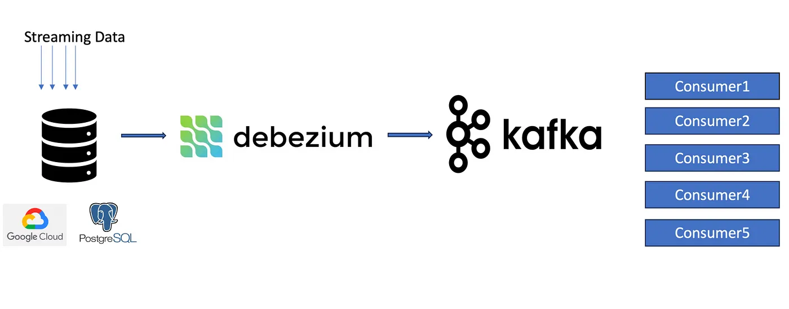

# CDC Debezium With Kafka
---
Change Data Capture (CDC) with:
- Kafka in KRaft mode
- Debezium - UI
- Postgres


## Container
---
| Name | Port |
|---|---|
|Kafka in KRaft mode| 9092 |
|Schema Registry| 8081 |
|Kafka UI | 8080 |
|PostgreSQL| 5432 |
|Debezium CDC  | 8083 |
|Debezium CDC UI | 8090 |

## Setup
---
1. Running docker-compose
```
docker-compose up -d
```
2. Create connector
```
make connect
```
3. Access Kafka UI
```
localhost:8080
```
4. Access Debezium UI
```
localhost:8090
```


## Debezium CDC Configurations
---
```json
{
    "name": "source-connector",
    "config": {
      "connector.class": "io.debezium.connector.postgresql.PostgresConnector",
      "database.hostname": "postgres",
      "database.port": "5432",
      "database.user": "postgres",
      "database.password": "postgres",
      "database.dbname": "test_db",
      "database.server.name": "local-test-db",
      "topic.prefix": "testdb-local",
      "schema.include.list": "public",
      "table.include.list": "public.users",
      "column.include.list": "public.users.id"
    }
  }
  
```
- `name`: Name to your connector.
- `database.hostname`: Public IP of your Postgres instance.
- `database.server.name`: Give any suitable name
- `topic.prefix`: Specify any Kafka topic name
- `schema.include.list`: Include schema list
Ex: Include Multi-schema: `public,inventory,food`
- `table.include.list`: Include table list. 
Ex: Include multi-table: `public.users,public.customers,public.posts`
- `column.include.list`: Include column of table.
Ex: Include multi-column: `public.users.id,public.users.name`

